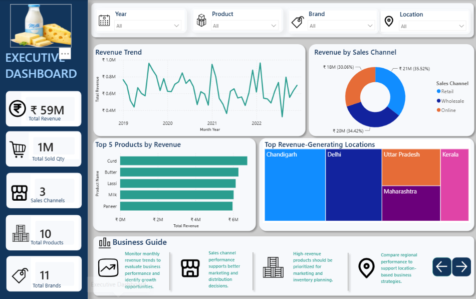
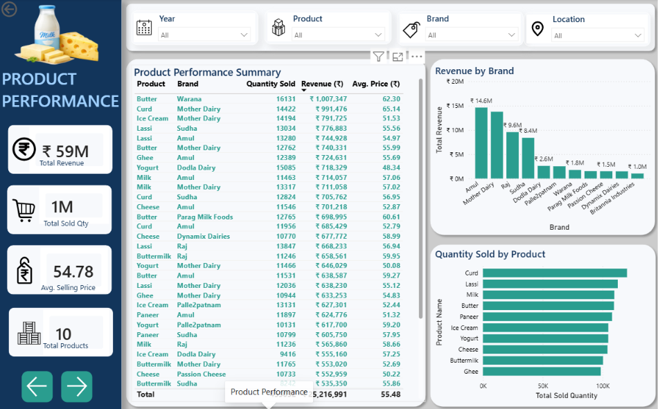
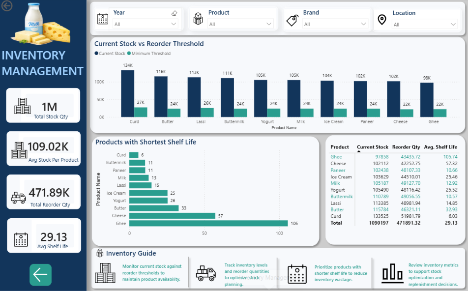

# Dairy Business Analytics Dashboard

An interactive Power BI dashboard designed to analyze dairy business performance across revenue, sales channels, product performance, and inventory management.

## Project Objective

The objective of this project is to transform dairy business data into an interactive analytical dashboard that helps users:

- Monitor revenue trends
- Compare sales channels
- Identify high-performing products and brands
- Analyze customer locations
- Monitor inventory levels
- Support replenishment planning
- Identify products with shorter shelf life

## Dataset

The dataset was obtained from Kaggle.

It contains information related to:

- Farms
- Products
- Brands
- Sales
- Revenue
- Customer Locations
- Sales Channels
- Inventory
- Production Dates
- Expiration Dates
- Storage Conditions

The dataset contained no missing or duplicate records.

## Tools & Technologies

- Power BI
- Power Query
- DAX
- Data Modeling
- Data Visualization

## Data Preparation

The following data preparation steps were performed:

- Validated data types
- Converted date fields to Date datatype
- Converted numerical fields to appropriate numeric datatypes
- Verified data consistency
- Created a dedicated Date Dimension

## Data Model

The main fact table used in the project is:

`Fact_Dairy`

A dedicated date dimension was created:

`Dim_Date`

The Date Dimension contains:

- Date
- Year
- Quarter
- Month
- Month Number
- Month-Year
- Day
- Weekday

An active one-to-many relationship was created between:

`Dim_Date[Date] → Fact_Dairy[Date]`

## DAX Measures

Important measures created in the dashboard include:

- Total Revenue
- Quantity Sold
- Total Products
- Total Brands
- Customer Locations
- Sales Channels
- Current Stock
- Total Reorder Quantity
- Low Stock Products
- Farm Count
- Average Shelf Life
- Storage Conditions

## Dashboard Pages

### Executive Dashboard

- Revenue Trend
- Revenue by Sales Channel
- Top 5 Products by Revenue
- Top Revenue-Generating Locations

### Product Performance

- Product Sales Summary
- Revenue by Brand
- Quantity Sold by Product

### Inventory Management

- Current Stock vs Minimum Stock Threshold
- Products with Shortest Shelf Life
- Inventory Summary

## Dashboard Preview

### Executive Dashboard

### Product Performance

### Inventory Management

## Key Business Value

The dashboard enables users to monitor business performance, compare products and brands, evaluate sales channels, and support inventory and replenishment decisions.

## Project Learnings

- Data preparation
- Power Query
- Data modeling
- Star schema concepts
- DAX measures
- KPI development
- Interactive dashboard design
- Business-focused data visualization

